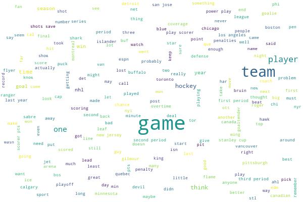
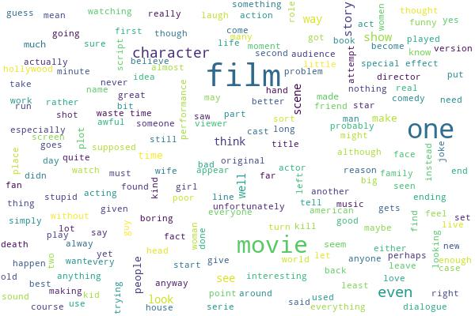
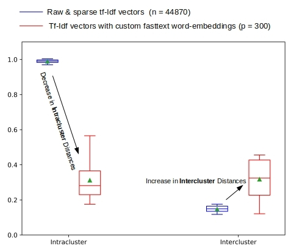
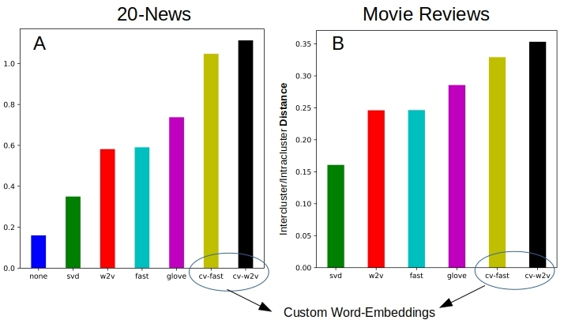
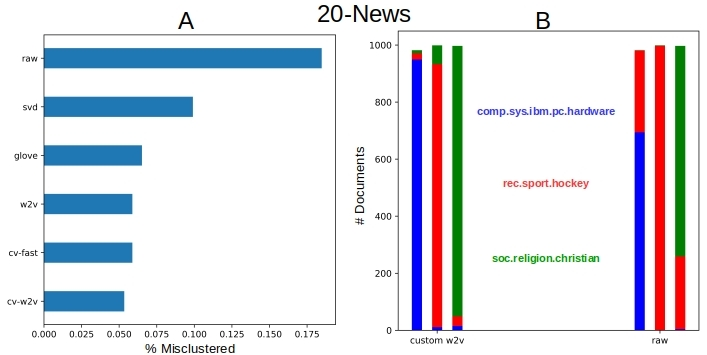
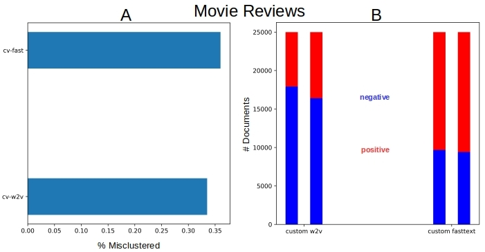

# Evaluating Document Transformations for Clustering Text

This is the source code to go along with the blog article  

[Clustering Text with Transformed Document Vectors](http://xplordat.com/2018/12/14/want-to-cluster-text-try-custom-word-embeddings/)

## Dependencies

	numpy
	elasticsearch
	nltk
	gensim
	scikit-learn
	wordcloud
	image
	matplotlib
	pyyaml

## Usage

### 1. Word Clouds

	cd wordclouds

	python ./plotWords.py twenty-news

to generate imges like:

(or)

	python ./plotWords.py acl-imdb 

to generate imges like:

### 2. Intra & Inter cluster distance transformations

	cd analysis
	python ./analyze.py twenty-news
	python ./processAnalysis.py twenty-news

	python ./analyze.py acl-imdb
	python ./processAnalysis.py acl-imdb

to generate the box-whisker plot:

and for the intercluster/intracluster ratio:

### 3. Clustering

	cd clusters
	mkdir logs
	./run.sh twenty-news
	./run.sh acl-imdb

Processing the results yields images like:

